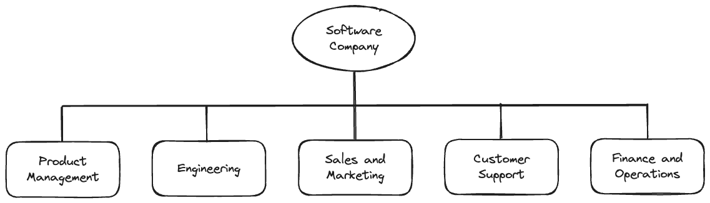
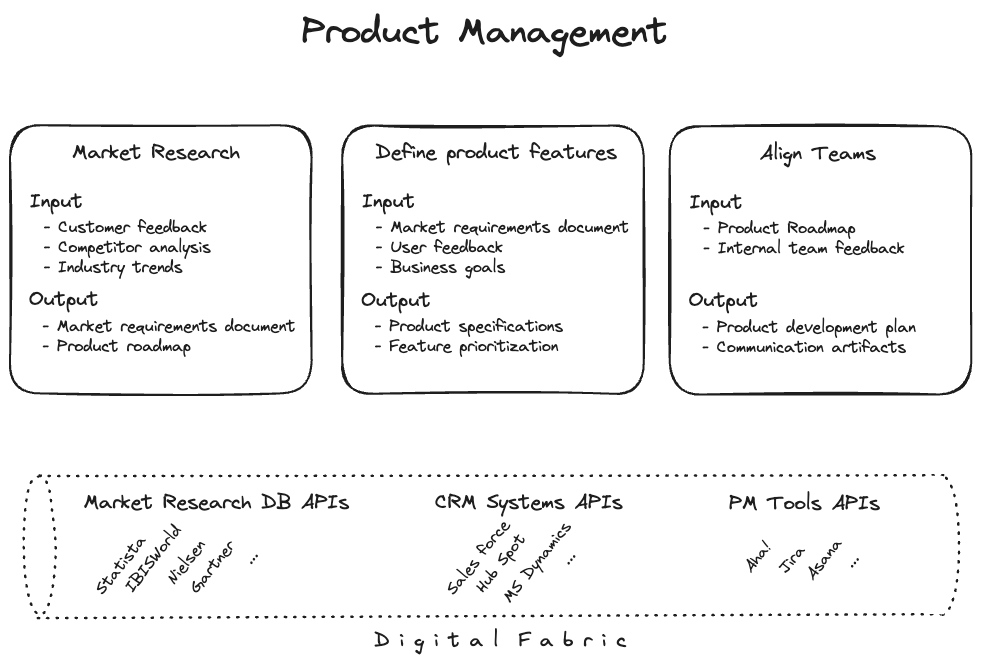
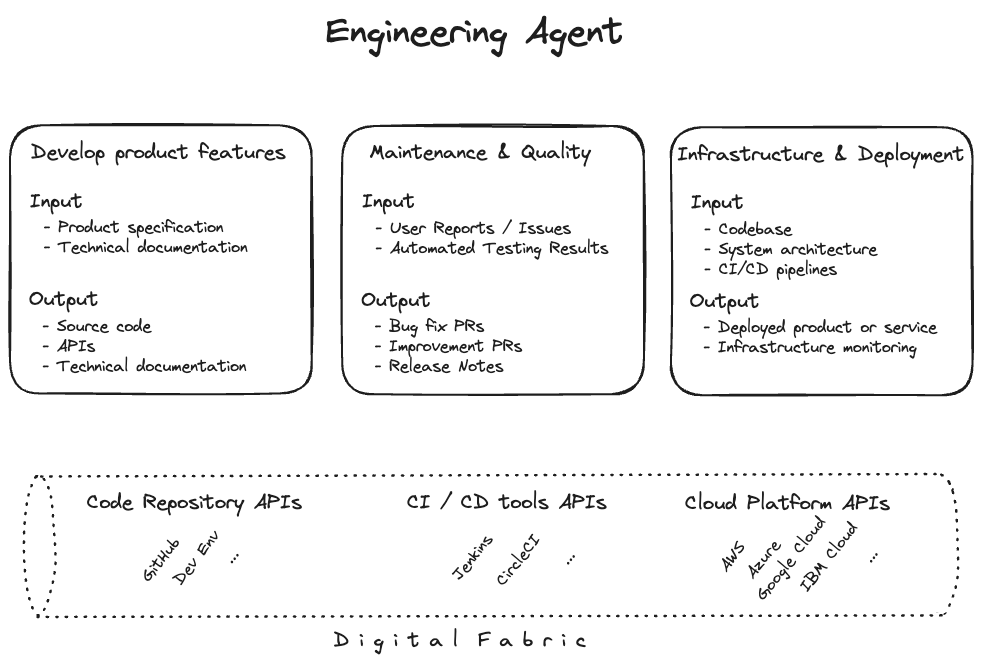
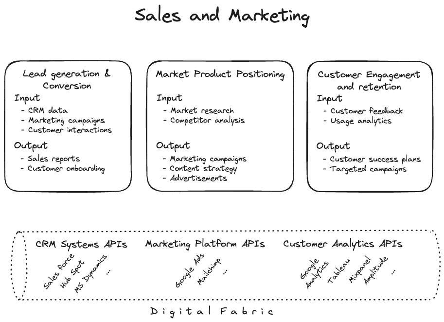
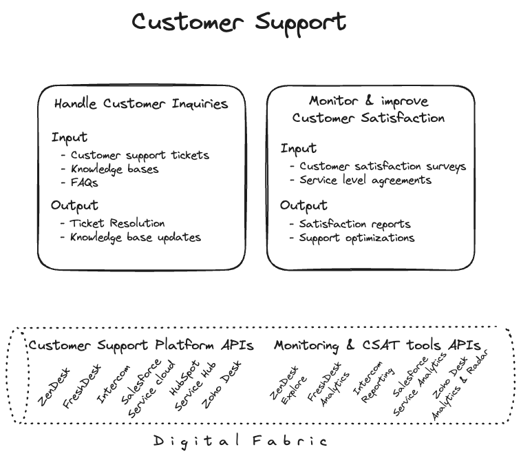
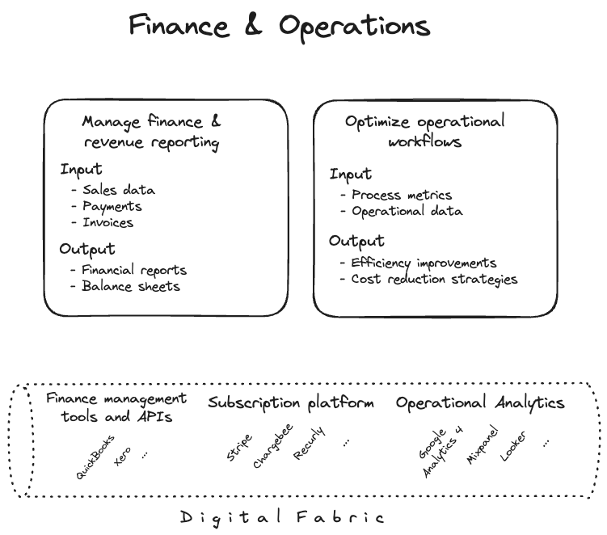
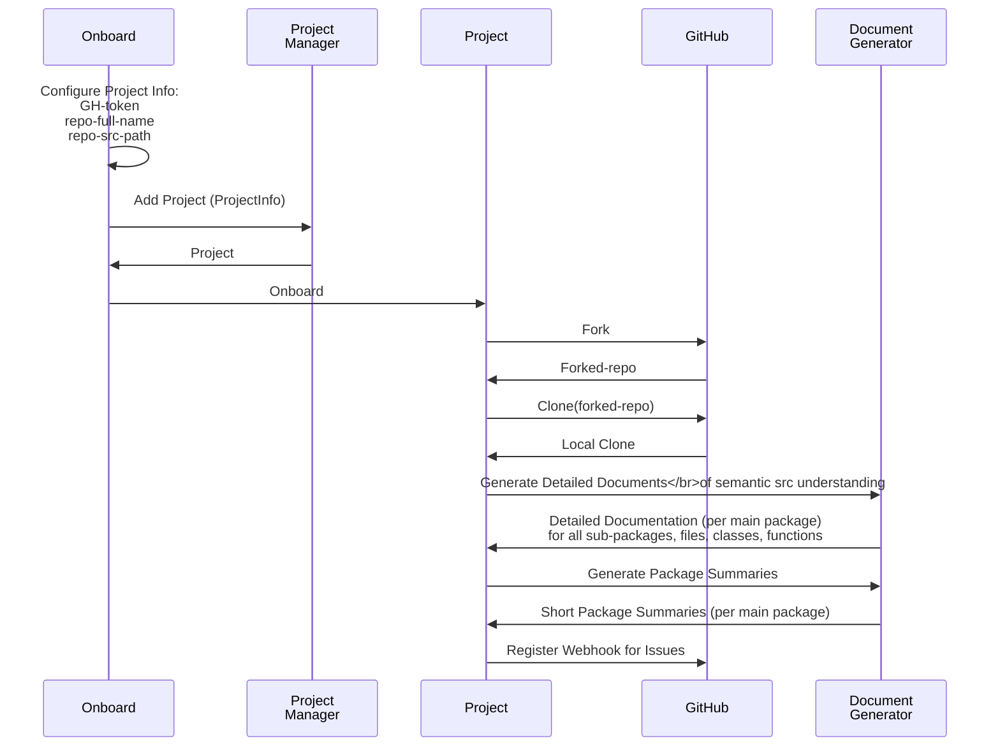
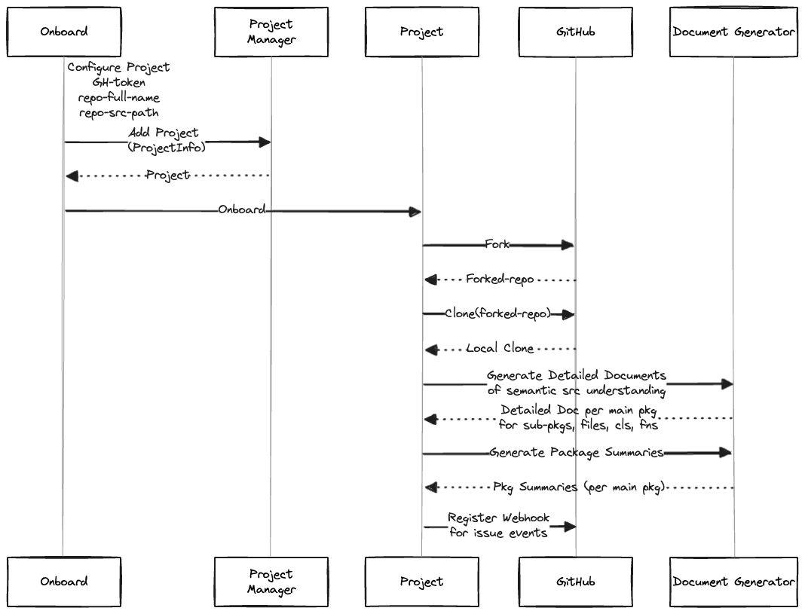
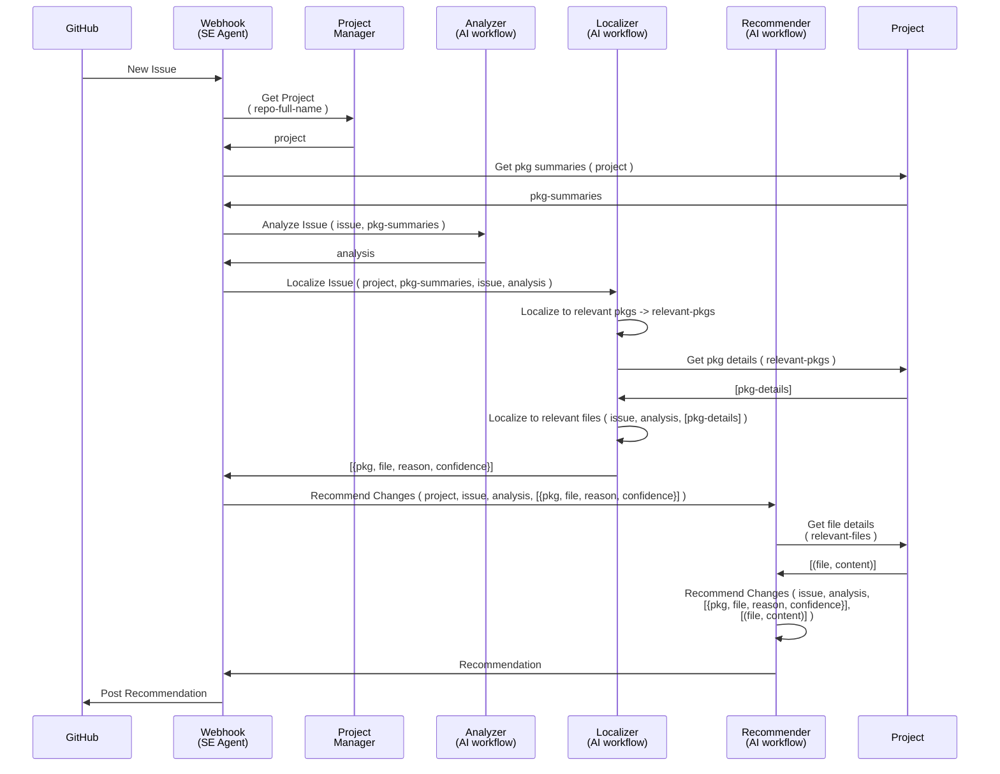
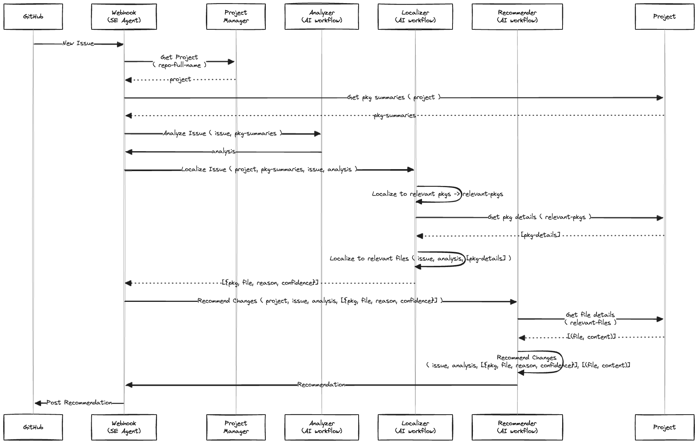

# Demo of the current Agent
<video src="media/se-agent.mp4" controls></video>

# Vision

An enterprise has a well defined organizational structure. The roles and responsibilities in such an organizational structure are well known. A digitally enabled enterprise empowers the people in those roles digital access and storage for the artifacts they require or produce while carrying out their responsibilities.

The vision of **AI Enterprise** is to create **AI Agents** that may play the role of (or assist) a person in the organizational structure, and carry out the responsibilities of that role. With the right access to the digital fabric, the AI agents may similarly access or store the digital artifacts they require or produce while carrying out the responsibilities they are implemented for.

Following are key activities to implement this vision:

1. Understand the organizational structure for a target business domain.
2. Know the roles and responsibilities in the organizational structure.
3. Understand each responsibility in detail to lay out the tasks and artifacts involved
4. Understand the AI workflows and engineering requirements to generate the outputs of the responsibilities from the inputs available. This may involve:
   - Prompt engineering
   - Model training and tuning
   - AI workflow implementation
5. Software Engineering plumbing to:
   - **Onboard the AI agents**
     - intitialize agent profile, persona
     - setting up agent's access to the digital fabric
     - any other proprocessing required to setup the agent, e.g.,
       - scan available data sources and created indices if required
       - generate any additional data that will help the agent at runtime
   - **Setting up Agent workflow triggers**
     - setup any listeners in the digital fabric that will trigger specific agent workflows

# Example AI Enterprise

Let's understand the vision of **AI Enterprise** with an example. Say we want to support an AI enterprise for a company that creates Software as Services. Its customers subscribe to and use these service. At a very high level, the organizational structure of such a company may look like this:

Let's assume each node here directly represents a role. For our AI enterprise vision, we need AI agents that should be able to play the roles in this organizational structure. Let's now understand the high-level responsibilities that these AI agents would need to carry out.

## Product Management

The following drawing shows the high-level responsibilities of the Product Management role along with the databases, tools, and APIs that the role may need to access to carry out those responsibilities.

An AI agent that plays the role of a Product Manager will need to implement AI workflows for each of those responsibilities. It will need to access the inputs required for those acivities from the digital fabric, generate the output artifacts and store them back in the digital fabric.

## Engineering

The following drawing shows the high-level responsibilities of the Engineering role along with the databases, tools, and APIs that the role may need to access to carry out those responsibilities.

In this respository we are implementing an AI agent for the **Engineering** role. We are beginning our implementation with a lighter variation of the **Maintenance & Quality** responsibility. In the lighter variation, the AI agent will monitor the newly created GitHub issues, and will recommend the changes in code that may be required to fix the issue.

## Sales and Marketing

The following drawing shows the high-level responsibilities of the Sales and Marketing role along with the databases, tools, and APIs that the role may need to access to carry out those responsibilities.

This is an active area of where companies like Salesforce, artisan.co, etc. are already providing AI agents as Sales and Business Development Representatives.

## Customer Support

The following drawing shows the high-level responsibilities of the Customer Support role along with the databases, tools, and APIs that the role may need to access to carry out those responsibilities.

This is another area of very active application of AI agents. In particular RAG flow on Knowledge bases are very popular in this area for handling first-tier customer support.

## Finance and Operations

The following drawing shows the high-level responsibilities of the Finance and Operations role along with the databases, tools, and APIs that the role may need to access to carry out those responsibilities.

# SE Agent

This repository focusses on the **Engineering** role and specifically on the **Maintenance & Quality** responsibility. Our Software Engineering (SE) Agent will monitor GitHub issues and recommend any changes to code that may fix the issue.

The AI workflow for in this specific implementation of the SE Agent is dividing into two phases:

**1. Onboarding Phase**
  - the SE Agent is configured with digital fabric accesses (the GitHub repo)
  - creates a new workspace in its store, by forking, and cloning the repo
  - generates detailed semantic documentation for the codebase in the workspace
    - for all the main packages
    - for all the files, classes, and functions in those packages
  - generates semantic summaries for the main packages in the workspace
  - And finally, registers a webhook for the issues in the GitHub repo

<!--

-->

Two key artifacts are generated in the onboarding phase:
  - **Package Details** organized by main packages, these documents conver semantics of all sub-packages, files, classes, and functions therein
  - **Package Summaries** based on the details, these have short summaries of the main packages, along with an aggregation of names of the files, classes, and functions in those packages

This hierarchical semantic understanding of the codebase is used by our SE agent in the **Recommendation Phase**.
  - First, to link the GitHub issues to the most relevant packages
  - Then, to localize the issue to the most relevant file, class, or function in the package
  - Finally, along with the content of most relevant files to recommend the changes in the code that may fix the issue

**2. Recommendation Phase**
  - the SE Agent listens to the GitHub issues
  - for each new issue, it:
    - links the issue to the most relevant packages
    - localizes the issue to the most relevant files, classes, or functions in the package
    - recommends the changes in code that may fix the issue
    - posts the recommendations as comments on the issue

<!--

-->

