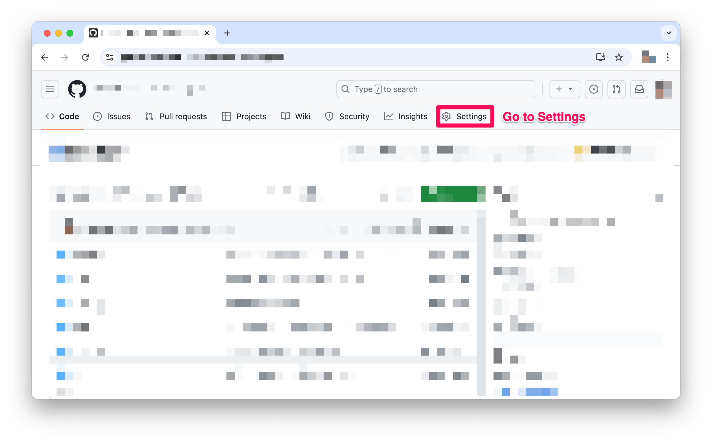
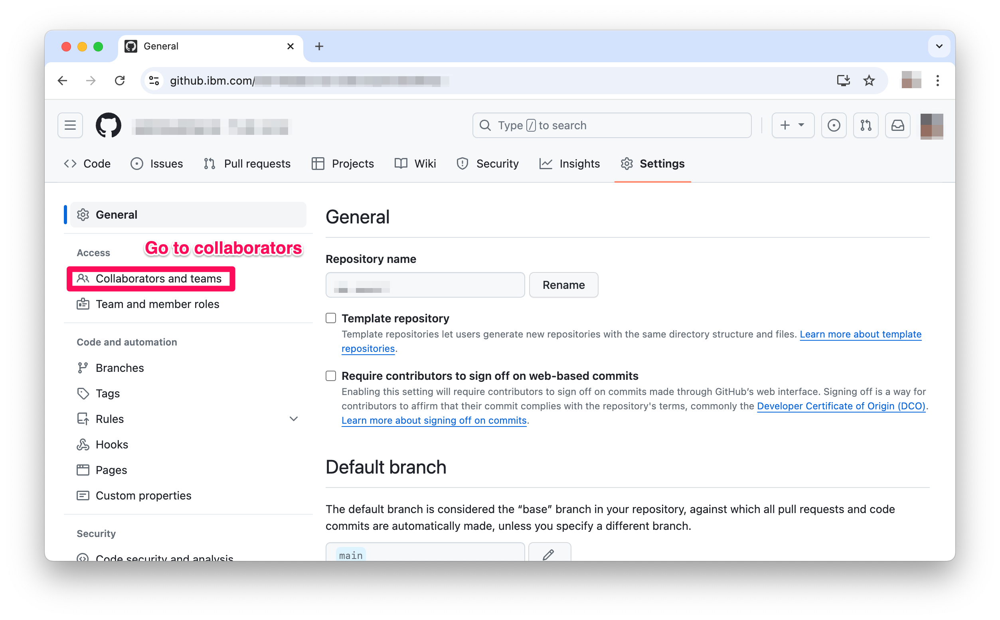
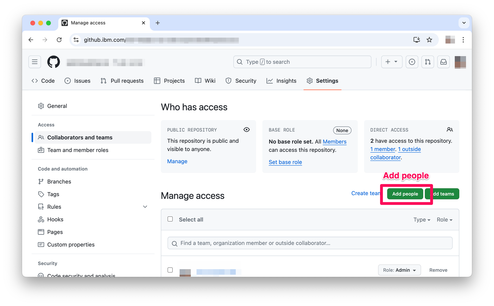
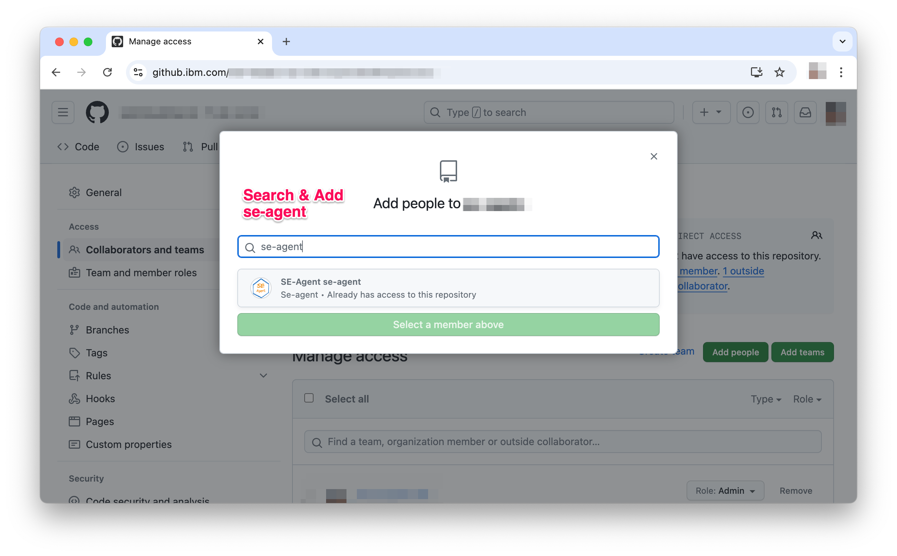
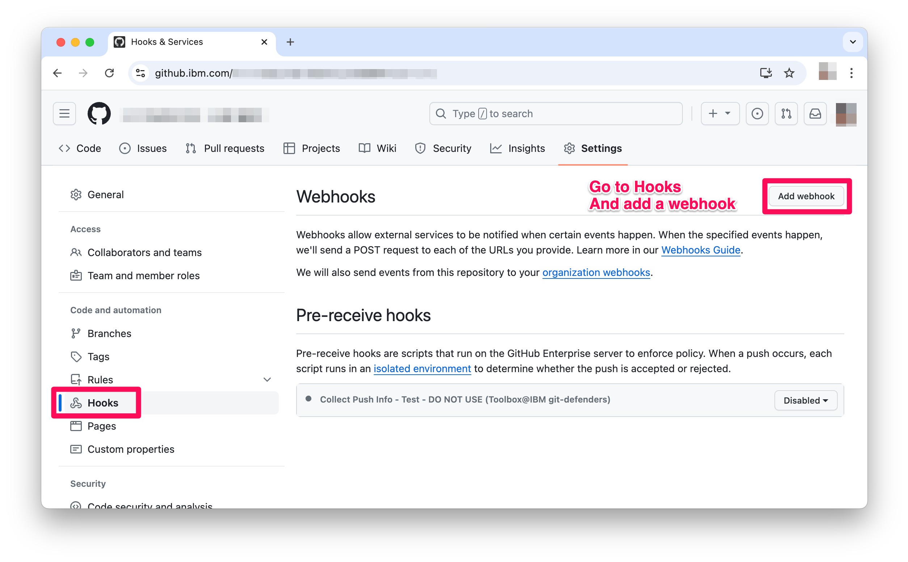
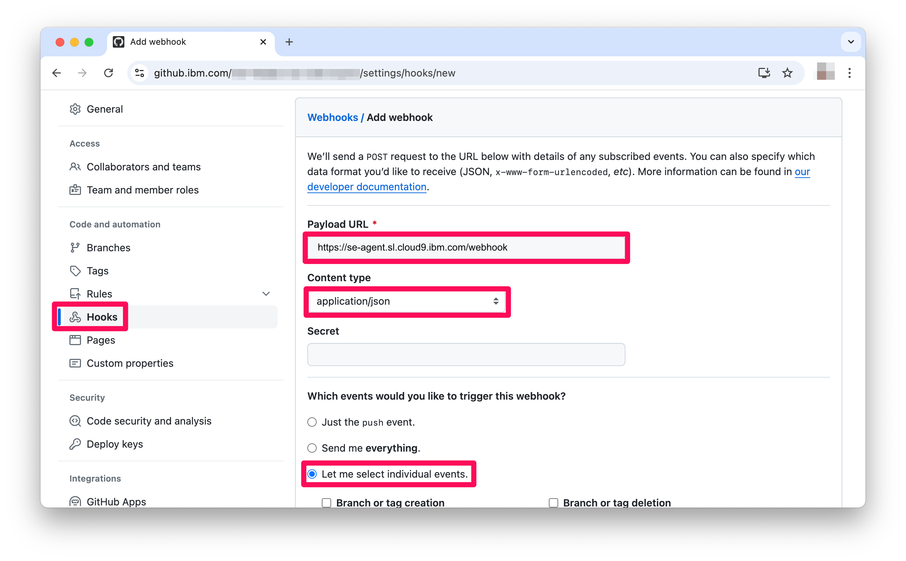
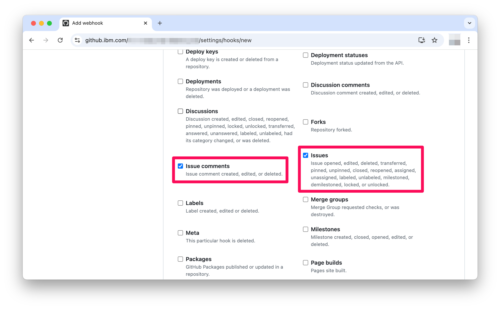
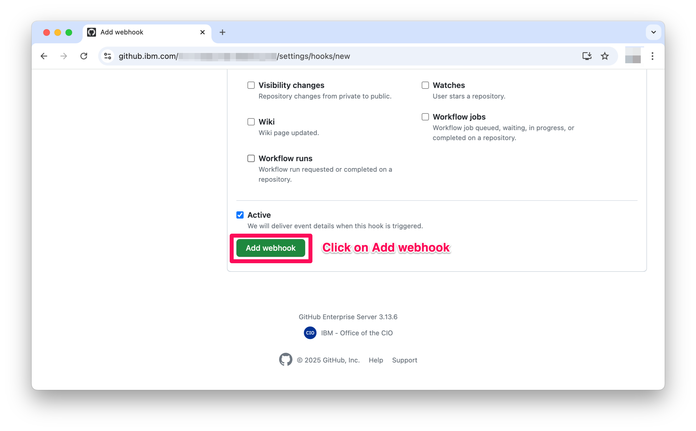
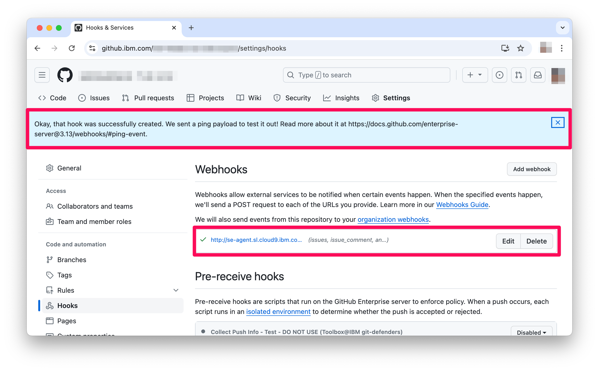
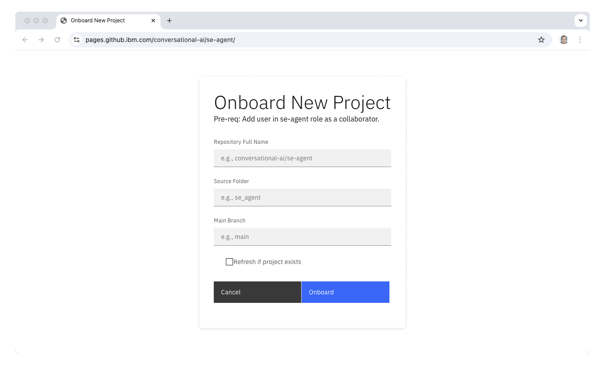

# Using se-agent for your python projects

## Video Guide

https://github.ibm.com/conversational-ai/se-agent/assets/14595/10820f11-5346-48c2-8afa-32280331b9fd

## Text Guide

### Grant Access to se-agent

1.  In your repository, go to **Settings**

    

2.  Go to **collaborators**

    

3.  Click on **Add People**

    

4.  Search & add **se-agent**

    

5.  Go to **hooks** and **add webhook**

    

6.  Add webhook details
    - **Payload URL**: `https://se-agent.sl.cloud9.ibm.com/webhook`
    - **Content type**: `application/json`
    - **Events to trigger webhook**: Choose `Let me select individual events`
        And then make sure to select:
        - *Issues.* se-agent will receive and process new issue creation
        - *Issue Comments.* se-agent will receive and process any user's comments on the issue
        - *Push.* se-agent will keep its understanding abreast of any changes to the repository

    

    

7.  And now add the webhook

    

8.  On successful addition of the webhook you should see something like the following

    


### Onboard
You may onboard your repo in one of the following two ways:

1.  Using the Onboarding UI.
2.  Using the Onboarding API.

#### Using the Onboarding UI

1.  Go to the Onboarding Page: https://pages.github.ibm.com/conversational-ai/se-agent
2.  Fill the form and click Onboard.
    - Onboarding process will generate a semantic understanding for each code file, and then a second order understanding for all top-level packages.
    - This will likely take time. E.g., For 25 code files in se-agent it takes roughly 5 mins (so it processes around 4 files / min)
    - For large repos the browser may timeout / drop connection. We are imporving the feedback mechanism for Onboarding process. In the meanwhile, you can drop a slack to Pankaj Dhoolia (pdhoolia) and I can help you track the status of onboarding.

    


#### Using the API

Execute the following cURL (supplying your repository details):

```curl
curl --request POST \
  --url https://se-agent.sl.cloud9.ibm.com/onboard \
  --header 'accept: application/json' \
  --header 'content-type: application/json' \
  --data '{"repo_full_name": "<organization>/<repo>","src_folder": "<python-src-root-relative-to-repo>","main_branch": "<branch>","api_url": "https://github.ibm.com/api/v3"}'
```

For the `se-agent` repo that is within `conversational-ai` organization and has the python code in the `se_agent` module root folder
E.g., following cURL command may be executed to onboard a repo in the `organization` "conversational-ai", `repository` "se-agent", `src root folder` (within the repo root) "se_agent", and the `main_branch` to understand as `main`; following is what the curl looks like

```curl
curl --request POST \
  --url https://se-agent.sl.cloud9.ibm.com/onboard \
  --header 'accept: application/json' \
  --header 'content-type: application/json' \
  --data '{"repo_full_name": "conversational-ai/se-agent","src_folder": "se_agent","main_branch": "main","api_url": "https://github.ibm.com/api/v3"}'
```
