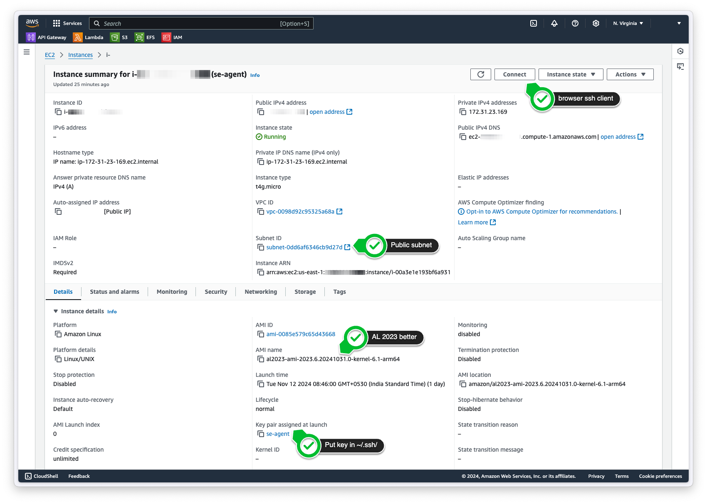
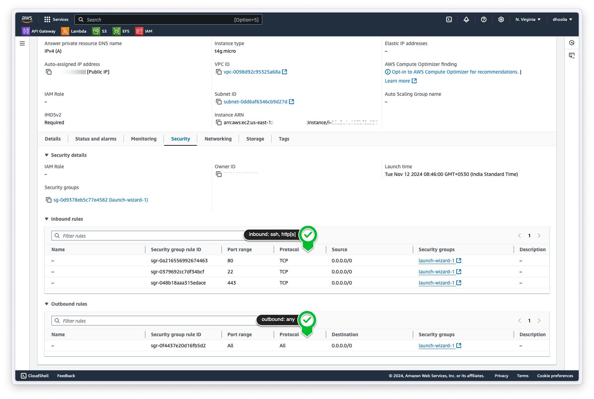
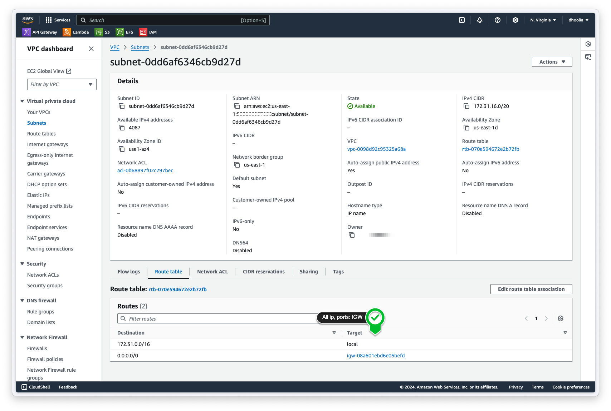
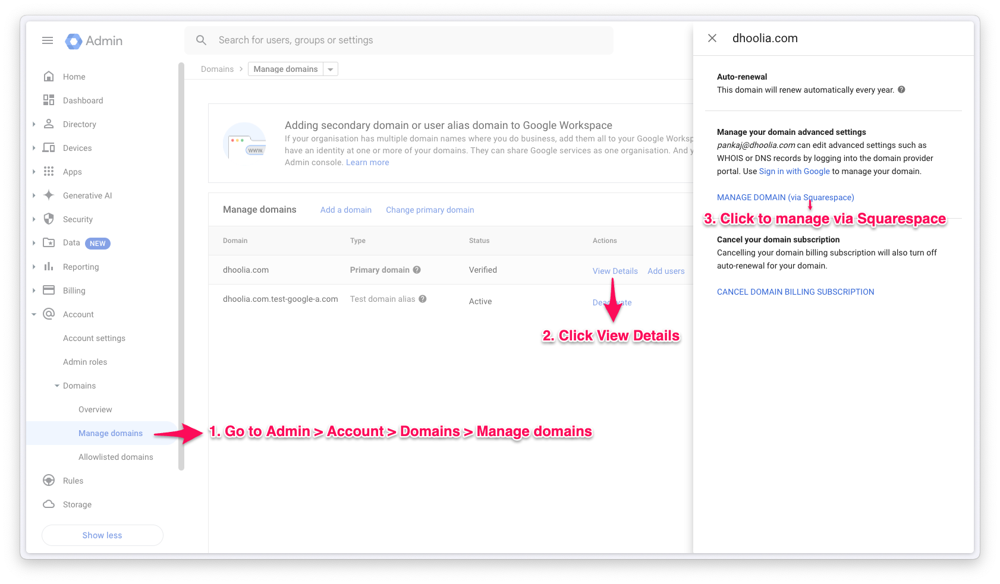
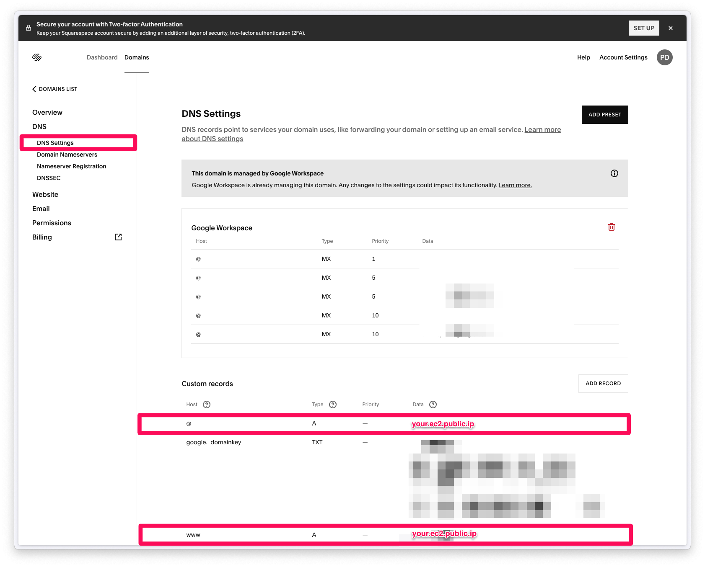

# Deploying se-agent on AWS EC2

1. Launch an EC2 instance
2. ssh into the instance
3. build python 3.12 from source
4. install git
5. clone se-agent repo
6. install se-agent dependencies
7. setup .env
8. install gunicorn
9.  Run se-agent flask using gunicorn
10. setup gunicon service (to start se-agent on boot)
11. run gunicon service
12. install nginx
13. setup nginx
14. run nginx
15. tail logs

## Launch an EC2 instance
This screen gives a rough overview of the launched instance


Following inbound and outbound security rules ensure that the instance can be accessed via ssh, http, and https


Following routing table rules ensure that the subnet on which the instance is launched has access to the internet


## SSH into the instance

1. Put the key files [pointed out earlier](#launch-an-ec2-instance) into the `~/.ssh` directory

2. Change the permissions of the key file

    ```bash
    chmod 400 ~/.ssh/se-agent.pem
    ```

3. And you are good to ssh into the instance

    ```bash
    ssh -i ~/.ssh/se-agent.pem ec2-user@<instance-public-ip>
    ```

## Build python 3.12 from source

Amazon Linux comes with python 3.9 pre-installed. To install python 3.12, we need to build it from source.

1. Update the system and install required dependencies

    ```bash
    sudo dnf update -y
    sudo dnf groupinstall "Development Tools" -y
    sudo dnf install -y bzip2-devel expat-devel gdbm-devel \
        libffi-devel openssl-devel ncurses-devel readline-devel \
        sqlite-devel tk-devel xz-devel zlib-devel
    ```

2. Download and extract python 3.12 source code

    ```bash
    wget https://www.python.org/ftp/python/3.12.7/Python-3.12.7.tgz
    tar -xzf Python-3.12.7.tgz
    cd Python-3.12.7
    ```

3. Configure and build python

    ```bash
    ./configure --enable-optimizations
    make -j $(nproc)  # to use all available cores
    sudo make altinstall  # to avoid overwriting the system python
    ```

4. Verify the installation

    ```bash
    python3.12 --version
    ```

5. Set up a virtual environment for Python 3.12

    ```bash
    python3.12 -m venv ~/python312env
    ```

6. Let's switch default `python` and `pip` commands to `python3.12`

    ```bash
    echo "alias python=python3.12" >> ~/.bashrc
    echo "alias pip=pip3.12" >> ~/.bashrc
    source ~/.bashrc
    ```

## Setup SE agent

1. Let's install git, since SE agent is dependent on it as well

    ```bash
    sudo dnf install git -y
    ```

2. Clone the SE agent repository

    ```bash
    git clone https://github.com/pdhoolia/se-agent.git
    cd se-agent
    ```
3. Activate the python 3.12 virtual environment

    ```bash
    source ~/python312env/bin/activate
    ```

4. Install SE agent dependencies

    ```bash
    pip install -r requirements.txt
    ```

5. Create a `.env` file in the root of the project and configure

    ```bash
    cp env.example .env
    nano .env
    ```

## Setup gunicorn to run SE agent as a service

1. Install gunicorn

    ```bash
    source ~/python312env/bin/activate
    pip install gunicorn
    ```

2. Create a new file:

    ```bash
    sudo nano /etc/systemd/system/gunicorn.service
    ```

3. Add the following content:

    ```bash
    [Unit]
    Description=Gunicorn instance to serve Flask app
    After=network.target

    [Service]
    User=ec2-user
    Group=ec2-user
    WorkingDirectory=/home/ec2-user/work/se-agent
    Environment="PATH=/usr/local/sbin:/usr/local/bin:/usr/sbin:/usr/bin:/sbin:/bin:/home/ec2-user/python312env/bin"
    Environment="PYTHONPATH=/home/ec2-user/work/se-agent"
    Environment="HOME=/home/ec2-user"
    ExecStart=/home/ec2-user/python312env/bin/gunicorn --workers 3 --bind 0.0.0.0:3000 --timeout 300 se_agent.flask_server:app

    [Install]
    WantedBy=multi-user.target
    ```

4. Enable and start service:

    ```bash
    sudo systemctl start gunicorn
    sudo systemctl enable gunicorn
    ```

    Later for any changes in the service file, reload the service as follows:

    ```bash
    sudo systemctl daemon-reload
    sudo systemctl restart gunicorn
    ```

## Setup nginx

1. Install nginx

    ```bash
    sudo dnf install nginx -y
    ```

2. To use nginx for HTTPS, we'll need to setup SSL certificates. For which, we'll need to obtain a domain, and forward it to the EC2 instance's public IP. I have a domain `dhoolia.com` from Google Workspace (via Squarespace). I will forward from it. So I'll create a nginx server configuration for that. Let's create a new server configuration file:

    ```bash
    sudo nano /etc/nginx/conf.d/dhoolia.conf
    ```

3. Let's add the following content:

    ```bash
    server {
        listen 80;
        listen [::]:80;
        server_name dhoolia.com www.dhoolia.com;

        location / {
            proxy_pass http://127.0.0.1:3000;
            proxy_set_header Host $host;
            proxy_set_header X-Real-IP $remote_addr;
            proxy_set_header X-Forwarded-For $proxy_add_x_forwarded_for;
            proxy_set_header X-Forwarded-Proto $scheme;
            proxy_read_timeout 300s;
            proxy_connect_timeout 300s;
            proxy_send_timeout 300s;
        }

        error_page 404 /404.html;
            location = /404.html {
        }

        error_page 500 502 503 504 /50x.html;
            location = /50x.html {
        }
    }
    ```

4. Test & restart Nginx:

    ```bash
    sudo nginx -t
    sudo systemctl restart nginx
    ```

5. Let's now setup SSL certificates. I'll use Certbot for that. First, let's install certbot:

    ```bash
    sudo dnf install certbot python3-certbot-nginx -y
    ```

6. Obtain SSL certificates:

    ```bash
    sudo certbot --nginx -d dhoolia.com -d www.dhoolia.com
    ```

7. Certbot will ask for an email address and agree to the terms and conditions. Once done, it will ask if you want to redirect all HTTP traffic to HTTPS. I'll choose `2` to redirect all traffic to HTTPS. Let's check the configuration file now.
    ```bash
    sudo nano /etc/nginx/conf.d/dhoolia.conf
    ```

    We should see modifications to the server block we created earlier.

    ```bash
    # HTTP Server Block
    server {
        listen 80;
        listen [::]:80;
        server_name dhoolia.com www.dhoolia.com;

        # Redirect all HTTP requests to HTTPS
        return 301 https://$host$request_uri;
    }

    # HTTPS Server Block
    server {
        listen 443 ssl;
        listen [::]:443 ssl;
        server_name dhoolia.com www.dhoolia.com;

        # SSL Certificates
        ssl_certificate /etc/letsencrypt/live/dhoolia.com/fullchain.pem;
        ssl_certificate_key /etc/letsencrypt/live/dhoolia.com/privkey.pem;

        # Optional SSL Settings
        ssl_protocols TLSv1.2 TLSv1.3;
        ssl_ciphers HIGH:!aNULL:!MD5;

        location / {
            proxy_pass http://127.0.0.1:3000;
            proxy_set_header Host $host;
            proxy_set_header X-Real-IP $remote_addr;
            proxy_set_header X-Forwarded-For $proxy_add_x_forwarded_for;
            proxy_set_header X-Forwarded-Proto $scheme;
            proxy_read_timeout 300s;
            proxy_connect_timeout 300s;
            proxy_send_timeout 300s;
        }

        # Error Pages
        error_page 404 /404.html;
        location = /404.html {
        }

        error_page 500 502 503 504 /50x.html;
        location = /50x.html {
        }
    }
    ```

8. Test & restart Nginx:

    ```bash
    sudo nginx -t
    sudo systemctl restart nginx
    ```

## Forward Squarespace domain to EC2 instance

1. Go to the domain settings in Google Workspace

    

2. Add new records to forward the domain to the EC2 instance's public IP

    

3. After a few minutes HTTP URLs `http://dhoolia.com` or `https://www.dhoolia.com` should be forwarded to the SE agent server running on our EC2 instance.

## Tail logs

1. To tail se-agent logs

    ```bash
    sudo journalctl -u gunicorn -f
    ```

2. To check last 100 lines of gunicorn logs

    ```bash
    sudo journalctl -u gunicorn -n 100
    ```
